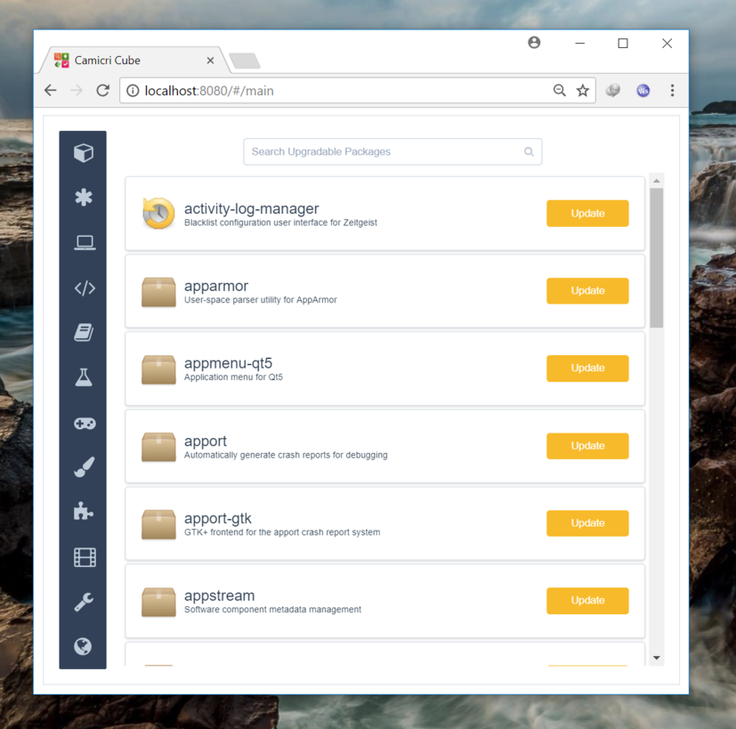
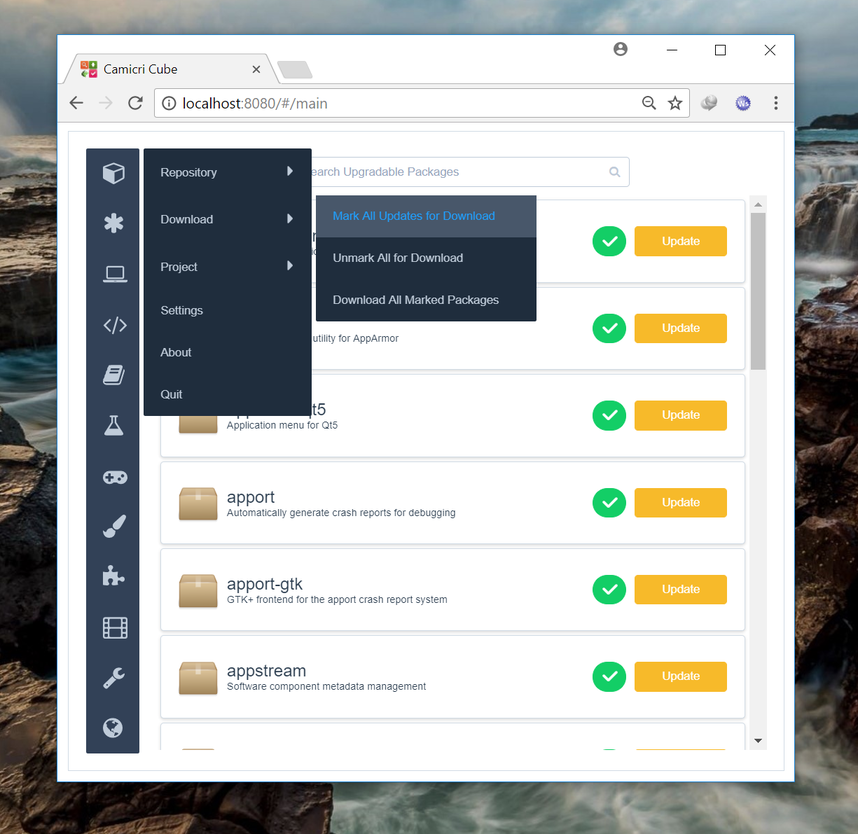
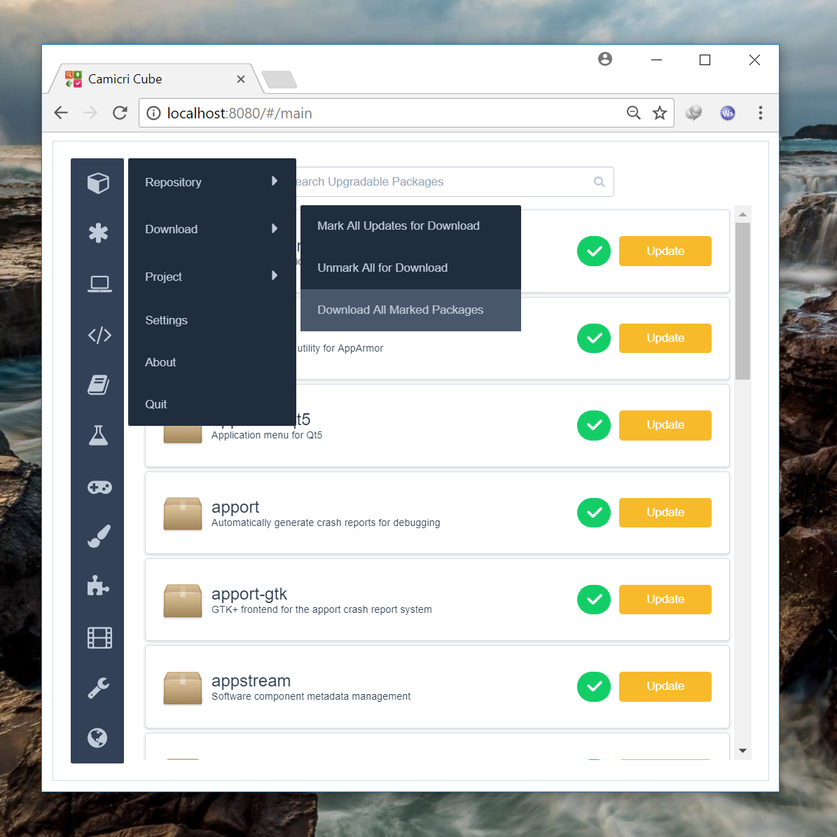
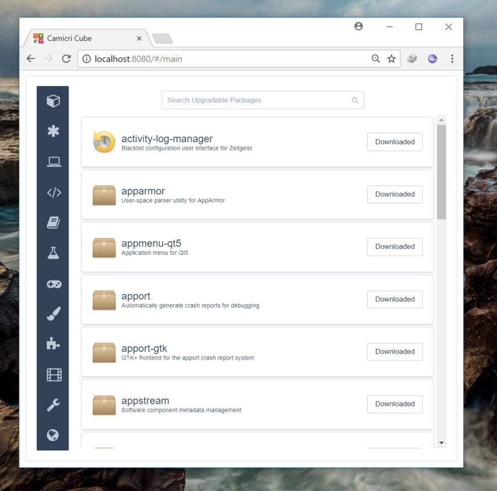
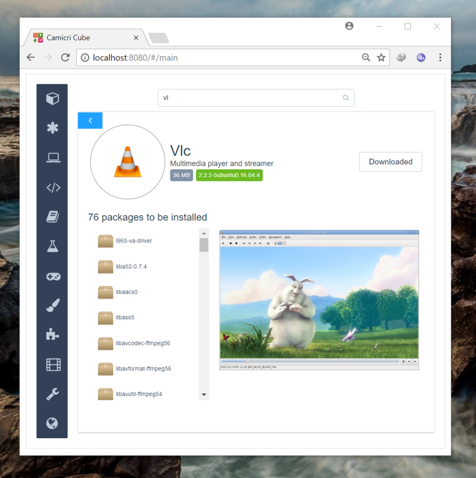
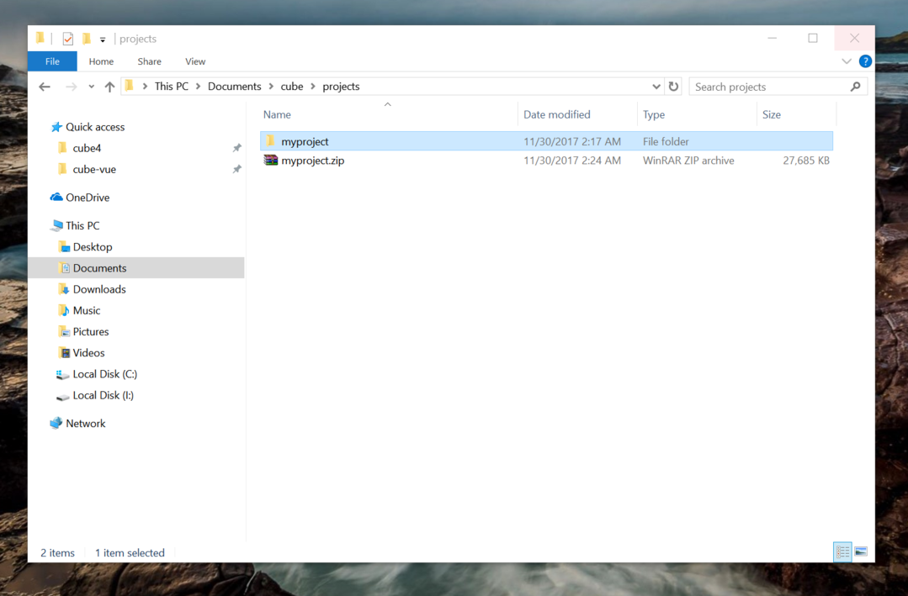

# Downloading Packages

A **package** is a compressed archive containing your application data. An application may have one or more packages. Cube will automatically determine which packages should be downloaded for your application.

Before we begin downloading specific packages, let's download first all packages that needs to be updated.

# Updating Outdated Packages

It is essential that you update your packages on a regular basis. This is to have their new features, prevent conflicts when installing new packages, and for security. Highly recommended to newly installed Linux system.

Click on `Asterisk -> Upgradable` to list all packages that needs to be updated.

Click on `Cube -> Download -> Mark All Updates for Download`.

Notice that each packages now have a check mark. These packages are now marked for download. You can click on the check mark to unmark a package.

Click on `Cube -> Download -> Download All Marked Packages` to start downloading.

A summary of packages to be downloaded will be shown.

A modal will appear, showing the overall download progress and the current package being downloaded.

And our package updates were now downloaded!

# Searching Packages
Cube provides two ways of searching/listing packages to find them easily.

#### Package Filter {docsify-ignore}
Package filters were provided to filter the packages being shown by Cube. 

`Asterisk` package filter. Showing the primary package filters.

`Games and Amusement`, a category type package filter. There were 9 categories you can use for filtering.

#### Search Bar {docsify-ignore}
The search bar is located at the top of the package list. Cube searches for packages as you type in the search bar.

!> The search bar will search packages under the currently selected package filter. To search package on all categories, make sure to click `Asterisk => Available` first.

# Downloading Package

Click `Download` to download the package.

The package viewer will appear, showing the application's desciption, screenshot (if available), and the list of packages needed for that application.

Click the `Download` button to start downloading.

The overall progress including the current progress of package being downloaded will be shown.

And your application is now downloaded!

# Transferring Project

After downloading repositories and packages, it is now the time to go back to your Linux computer to install them.

Click `Cube => Quit` to close Cube.

Open `cube\projects` folder. Compress your project and transfer it to any removable devices.

