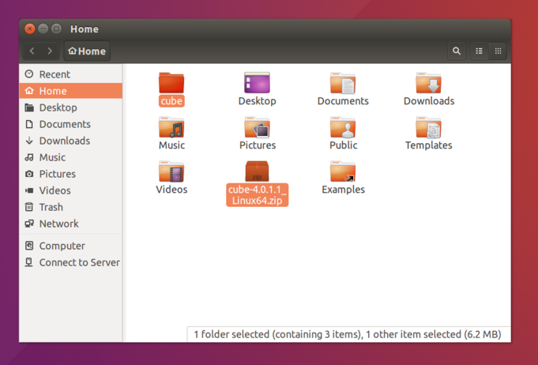
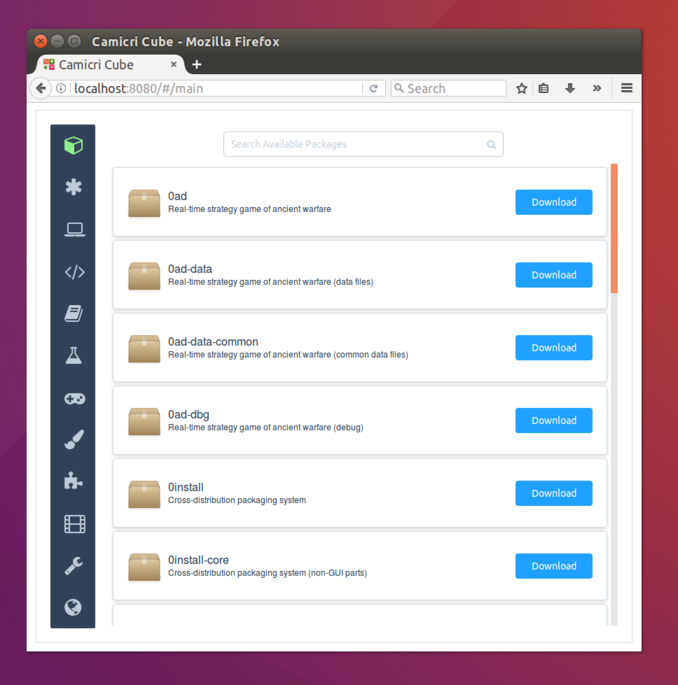
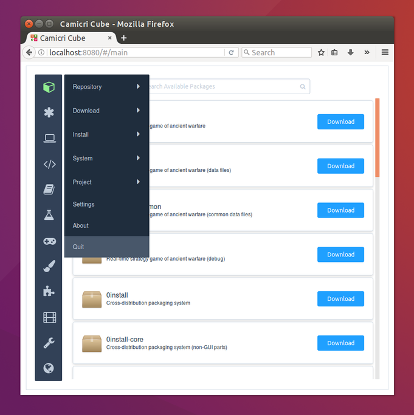

# Setting up on Offline Linux

In this guide, I'm going to show you how to setup Cube on an offline Linux computer. Here, I'll be using Ubuntu 16.04 LTS. Note that this computer doesn't have internet connection.

## Setting up Cube

Copy and extract the downloaded cube zip in your home directory.

Then, open `cube` folder.

## Launching Cube

To Launch Camicri Cube, just double click the `cube` application.
A terminal and a web browser will appear.

## Creating Project
Projects are essential in the Cube application. A project contains the information about your computer. This includes the list of repositories, currently installed packages and the architecture of your computer.

Projects created in cube will be saved in `cube/projects` directory.

Provide a name for your project (`myproject` in this case) and click `Create` to create the project.

Click `Open` to load the project.

Cube now loads your project. On this stage, Cube is now reading your project's repositories to check for all available, installed and needs to be updated packages.

Once done, the Cube's main interface will be displayed.

## Transferring Project

Since this Linux computer is offline, you will not be able to download packages.
We need to find a computer with internet connection.

The project we have created earlier will be transferred on a computer with internet connection.

Close the Cube by clicking the `Cube` icon and `Quit`

On the project's folder `cube/projects`, compress the newly created project and save it to any removable device.

On the [next](/setup-windows) guide, we will be going to download packages on another computer with internet connection.