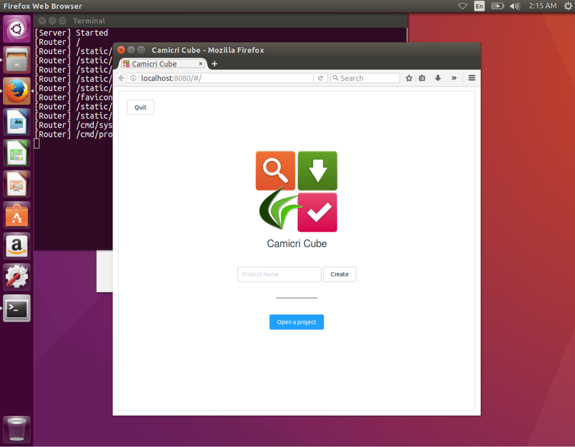
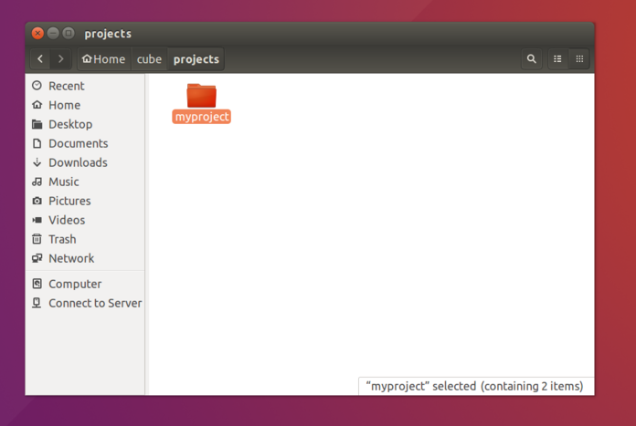

## Setting up Cube

**About this Guide**

The purpose of this entire guide is to show how you will be able to update your repositories and install new packages from your offline Linux computer using Cube, and with the help of another computer with internet access.

Here, we will be going to setup Cube in your offline Linux computer. We will be using `Ubuntu 16.04 LTS` for this guide.

Assumming that you have downloaded the cube zip, copy and extract the zip in your `home` folder. If you haven't downloaded it yet, check our [Download](/download) page.

A folder named `cube` will be extracted. Now, open the `cube` folder.

Cube folder contains the following:

`cube-system` - where Cube's system files are stored, 

`projects` - where your project files will be stored (You'll learn more about this later)

`cube` - Cube's application executable.

## Launching Cube

To Launch Camicri Cube, just double click the `cube` application.

A terminal and a web browser will appear.

** Alternative way of launching cube **

If Cube fails to load by double clicking the `cube` application file, you may launch it using a terminal.

1. Open terminal (Press CTRL+ALT+T)
2. Type and enter below command
        cd ~/
        cd cube
        chmod +x cube
        ./cube --terminal

## Creating Project
**Projects** are essential in the Cube application. A project file will contain your Linux computer's repository list and installed packages. This data will be used by Cube in determining packages compatible in your system to be downloaded and installed.

Projects created in cube will be saved in `cube/projects` directory.

Provide a name for your project (`myproject` in this case) and click `Create` to create the project.

Click `Open` to load the project.

Cube will now be reading your project's repositories to check for all available, installed and needs to be updated packages.

Once done, the Cube's main interface will be displayed.

## Transferring Project

Since this Linux computer is offline, you will not be able to download packages.
We need to find a computer with internet connection.

The project we have created earlier will be transferred on a computer with internet connection.

Close the Cube by clicking the `Cube` icon and `Quit`

On the project's folder `cube/projects`, compress the newly created project and transfer it to any removable device.

On the [next](/setup-windows) guide, we will show you how to setup Cube on another computer with internet connection, and use your project to download new packages for your offline Linux computer.